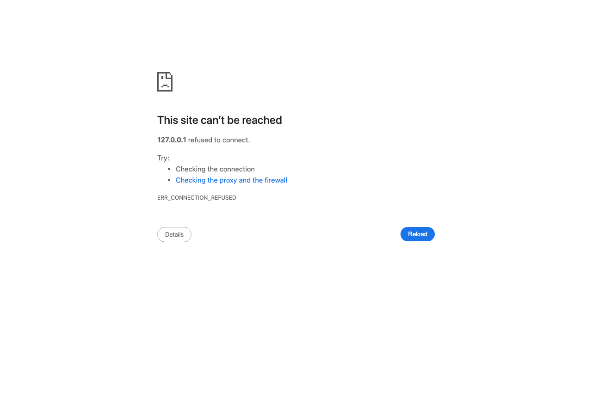
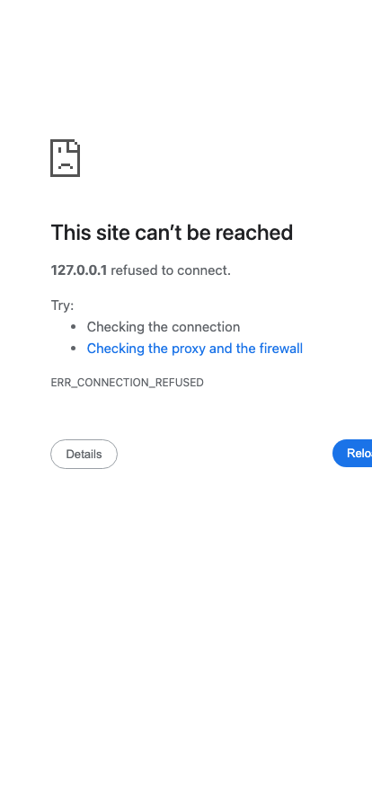

# JouleNet

> Wi-Fi provisioning + network manager for ESP32 / ESP8266. Captive
> portal, **multi-SSID auto-failover**, 9 custom-parameter types, static
> IP, mDNS, country code, NVS-backed persistence, live diagnostics.
> MIT-licensed, mobile-first, **5.3 KB on the wire**.



**Author:** [Chinmoy Bhuyan](mailto:dikibhuyan@gmail.com) · **License:** MIT
· **Targets:** ESP32 (S2 / S3 / C3 / classic), ESP8266

---

## Features

| | |
|---|---|
| 📶 **Multi-SSID auto-failover** | Save several networks; on boot the strongest reachable one wins |
| 🪤 **Captive portal** | DNS hijack on the SoftAP pops the setup page on every connected device automatically |
| 🎛 **9 custom-parameter types** | `text` · `password` · `number` · `dropdown` · `color` · `toggle` · `textarea` · `header` · `divider` |
| 🌐 **Static IP / DHCP / mDNS** | Configurable from the portal or by code |
| 🏷 **Hostname + country code** | Set per device; survives reboots |
| 💾 **NVS persistence** | Atomic writes via Preferences; parameters survive flash erase only |
| 🔁 **Reprovision watchdog** | If Wi-Fi stays down longer than your threshold, the portal pops automatically |
| 🩺 **Live diagnostics** | `/wifi/status` JSON returns SSID, IP, gateway, BSSID, RSSI, channel, heap, uptime |
| ⚡ **Sync + async modes** | `blockingConnect(timeout)` for setup() flows; `autoConnect()` + callbacks for everything else |
| 🎨 **Theme aware** | Dark / light / auto; user choice persists |
| 📱 **Mobile-first portal** | 44 px touch targets, viewport-fit safe-area, glass-morphism panels |
| 🪶 **5.3 KB on the wire** | Pre-gzipped UI served with `Content-Encoding: gzip` |

---

## Quick start

```cpp
#include <WiFi.h>
#include <ESPAsyncWebServer.h>
#include <JouleNet.h>

AsyncWebServer server(80);

void setup() {
  JouleNet.setApCredentials("MyDevice-Setup");
  JouleNet.setHostname("mydevice");
  JouleNet.setMdnsName("mydevice");

  JouleNet.addParameter({"mqtt_host", "MQTT host", joule::NetParamType::Text,
                         "broker.local", "fqdn or ip", "", 0, 0});
  JouleNet.addParameter({"mqtt_port", "MQTT port", joule::NetParamType::Number,
                         "1883", "", "", 1, 65535});

  JouleNet.begin(&server);
  server.begin();
  JouleNet.autoConnect();
}

void loop() {
  JouleNet.loop();   // pumps DNS, portal watchdog, reconnect
}
```

First boot: the SoftAP `MyDevice-Setup` comes up at `192.168.4.1`.
Connect a phone → portal opens automatically → pick Wi-Fi → device joins
and reboots into station mode. Subsequent boots skip the portal.

---

## API reference

### Setup

```cpp
void setApCredentials  (const String &ssid, const String &password = "");
void setHostname       (const String &h);
void setMdnsName       (const String &n);
void setCountryCode    (const String &cc);          // e.g. "US", "IN", "01"
void setBrandColor     (const String &cssColor);
void setTitle          (const String &t);
void setAutoReconnect  (bool on);                   // default true
```

### Timing

```cpp
void setPortalTimeoutMs (uint32_t ms);   // 0 = keep portal up forever
void setConnectTimeoutMs(uint32_t ms);   // default 15000
void setReprovisionMs   (uint32_t ms);   // 0 = never auto-reopen portal
```

### Static IP

```cpp
void setStaticIP(IPAddress ip, IPAddress gw, IPAddress mask, IPAddress dns = (uint32_t)0);
void clearStaticIP();
```

### Credentials

```cpp
void saveCredentials(const String &ssid, const String &password, bool hidden = false);
void clearAllCredentials();
std::vector<NetCreds> savedNetworks() const;
```

The library keeps up to 8 saved networks in NVS. `autoConnect()` tries
them in saved order; the strongest reachable wins.

### Custom parameters

```cpp
enum class NetParamType : uint8_t {
  Text=0, Password, Number, Toggle, Dropdown, Color, Header, Divider, Textarea
};

struct NetParam {
  String       key;
  String       label;
  NetParamType type;
  String       value;
  String       hint;
  String       opts;          // dropdown only: "one|two|three"
  int          min = 0, max = 0;   // number only
};

void addParameter(const NetParam &p);
String paramValue(const String &key) const;
```

Parameters render on the **Setup** tab of the portal. Values persist to
NVS (`Preferences` namespace `joulenet`, key `p_<param-key>`). Add them
**before** `begin()`.

Example covering every type:

```cpp
JouleNet.addParameter({"sec1",   "Application", joule::NetParamType::Header,  "","","",0,0});
JouleNet.addParameter({"room",   "Room name",   joule::NetParamType::Text,    "Lab","where is this device?","",0,0});
JouleNet.addParameter({"mqtt_h", "MQTT host",   joule::NetParamType::Text,    "broker.local","fqdn or ip","",0,0});
JouleNet.addParameter({"mqtt_p", "MQTT port",   joule::NetParamType::Number,  "1883","","",1,65535});
JouleNet.addParameter({"mqtt_pw","MQTT password",joule::NetParamType::Password,"","","",0,0});
JouleNet.addParameter({"region", "Region",      joule::NetParamType::Dropdown,"EU","","EU|US|APAC|other",0,0});
JouleNet.addParameter({"colour", "Accent",      joule::NetParamType::Color,   "#7c5cff","","",0,0});
JouleNet.addParameter({"verbose","Verbose logs",joule::NetParamType::Toggle,  "1","","",0,0});
JouleNet.addParameter({"sec2",   "Notes",       joule::NetParamType::Divider, "","","",0,0});
JouleNet.addParameter({"notes",  "Site notes",  joule::NetParamType::Textarea,"line 1\nline 2","free-form","",0,0});
```

### Lifecycle

```cpp
void begin           (AsyncWebServer *server);   // mount routes; loads NVS
void autoConnect     ();                         // try saved → portal if all fail
bool blockingConnect (uint32_t timeoutMs = 20000);
void startPortal     ();
void stopPortal      ();
void resetAndReboot  ();                         // wipe NVS namespace + restart
void loop            ();                         // DNS, watchdog
```

### Callbacks

```cpp
enum class NetState { Idle, Connecting, Connected, Portal, Failed };

void onState (std::function<void(NetState)> cb);
void onConfig(std::function<void(const std::vector<NetParam>&)> cb);
```

### Status accessors

```cpp
NetState  getState();      // Idle / Connecting / Connected / Portal / Failed
IPAddress localIP();
IPAddress gatewayIP();
IPAddress subnetMask();
IPAddress apIP();
String    bssid();
int       rssi();
uint8_t   channel();
String    activeSsid();
```

---

## HTTP endpoints

| Path | Method | Description |
|---|---|---|
| `/wifi`         | GET  | The portal SPA |
| `/wifi/scan`    | GET  | JSON: visible networks (`ssid`, `rssi`, `ch`, `bssid`, `sec`) |
| `/wifi/connect` | POST | `{"ssid":"...","password":"...","hidden":false,"hostname":"…","countryCode":"…","staticIp":"…","gateway":"…","netmask":"…"}` |
| `/wifi/status`  | GET  | JSON diagnostics (see below) |
| `/wifi/params`  | GET  | List of registered parameters |
| `/wifi/params`  | POST | `{"key":"value", …}` to update |
| `/wifi/reset`   | POST | Erase NVS + reboot |
| `/wifi/restart` | POST | Reboot only |
| `/`, `/generate_204`, `/gen_204`, `/hotspot-detect.html`, `/ncsi.txt` | GET | OS captive-portal probes (all serve the portal page) |

### `/wifi/status` payload

```json
{
  "state":    2,
  "ssid":     "MyNetwork",
  "ip":       "192.168.1.100",
  "gateway":  "192.168.1.1",
  "mask":     "255.255.255.0",
  "dns":      "192.168.1.1",
  "bssid":    "28:EE:52:EA:23:FC",
  "channel":  10,
  "rssi":     -86,
  "hostname": "joule-demo",
  "mdns":     "joule-demo.local",
  "mac":      "D0:CF:13:73:0A:B8",
  "heap":     258188,
  "uptime_s": 124
}
```

`state` is `0=Idle 1=Connecting 2=Connected 3=Portal 4=Failed`.

### `/wifi/params` payload

```json
{ "params": [
    { "key":"room",  "label":"Room name", "type":"text",   "value":"Lab",    "hint":"…", "opts":"", "min":0, "max":0 },
    { "key":"notes", "label":"Site notes","type":"textarea","value":"line1\nline2", "hint":"", "opts":"", "min":0, "max":0 },
    …
]}
```

---

## UI walkthrough

The portal has three tabs:

| Tab | Contents |
|---|---|
| **📶 Wi-Fi** | Live network list with signal-bar glyphs (▂▄▆█), lock icon, password field, hidden-SSID input, **Advanced** reveal (hostname / country code / static IP / gateway / netmask), Connect button |
| **⚙ Setup** | Custom-parameter form auto-rendered from `/wifi/params` — every type from the table above |
| **📊 Status** | Live diagnostics from `/wifi/status` (auto-refreshes every 3 s), Restart button, Erase-and-reboot button (red, confirmation) |

Mobile (390 px wide):



---

## NVS schema

Namespace: `joulenet` (Preferences API).

| Key      | Type    | Purpose |
|---|---|---|
| `n`      | uint8   | Count of saved networks (0–8) |
| `s0`…`s7`| string  | SSID per slot |
| `p0`…`p7`| string  | Password per slot |
| `h0`…`h7`| bool    | Hidden flag per slot |
| `hostname` | string | mDNS hostname |
| `country`  | string | Country code |
| `mdns`     | string | mDNS service name |
| `sta`      | bool   | Static IP enabled? |
| `ip`,`gw`,`mk`,`dn` | uint32 | Static IP block (when sta = true) |
| `p_<key>`  | string | Custom parameter value |

`resetAndReboot()` clears the entire namespace.

---

## Patterns

### Read a saved parameter

```cpp
String mqttHost = JouleNet.paramValue("mqtt_host");
int    port     = JouleNet.paramValue("mqtt_port").toInt();
bool   verbose  = JouleNet.paramValue("verbose") == "1";
```

### Reach the portal even while connected

The portal stays mounted at `/wifi` even after `autoConnect()` succeeds.
Useful for in-field reconfiguration without rebooting:

```bash
# from your laptop on the same LAN
open http://device.local/wifi
```

### React to state changes

```cpp
JouleNet.onState([](joule::NetState s){
  if (s == joule::NetState::Connected) {
    setupMqtt();
  } else if (s == joule::NetState::Portal) {
    showSetupHintOnDisplay();
  }
});
```

### React to parameter changes

```cpp
JouleNet.onConfig([](const std::vector<joule::NetParam>& params){
  // user saved the Setup tab — re-read what matters
  reconfigureMqtt();
});
```

### Static IP from code

```cpp
JouleNet.setStaticIP(
  IPAddress(192,168,1,200),
  IPAddress(192,168,1,1),
  IPAddress(255,255,255,0),
  IPAddress(1,1,1,1));      // optional DNS
```

### Block until connected (legacy-style)

```cpp
if (!JouleNet.blockingConnect(15000)) {
  Serial.println("Wi-Fi failed — opening portal");
  JouleNet.startPortal();
}
```

---

## Captive-portal mechanics

When the portal is up, JouleNet runs a UDP **DNS server on port 53** that
answers every query with the SoftAP's IP. Modern OSes then issue a known
"connectivity probe" URL:

| OS       | Probe URL |
|---|---|
| Android  | `http://connectivitycheck.gstatic.com/generate_204` |
| iOS/macOS| `http://captive.apple.com/hotspot-detect.html` |
| Windows  | `http://www.msftncsi.com/ncsi.txt` |

JouleNet's handlers for these exact paths serve the portal HTML, so the
OS pops the setup screen automatically — no manual "192.168.4.1" needed.

---

## Troubleshooting

| Symptom | Cause | Fix |
|---|---|---|
| `tcpip_api_call ... Invalid mbox` panic on boot | `WiFi.setHostname()` called before lwIP init | The library calls `WiFi.mode(WIFI_STA)` first — make sure you don't call `WiFi.setHostname()` yourself before `JouleNet.begin()` |
| Phone connects to AP but no portal pops | Captive-portal probe blocked by firewall or VPN | Manually browse to `http://192.168.4.1/wifi` |
| Connect button times out | Wrong password or out-of-range network | Watch the Status tab; it shows the live state |
| Saved network never reconnects after router reboot | `setAutoReconnect(false)` set | Re-enable, or call `WiFi.reconnect()` in `loop()` |
| Custom params don't show | `addParameter()` called after `begin()` | Move the calls **before** `begin()` |

---

## Dependencies

* `ESP32Async/ESPAsyncWebServer @ ^3.7.0`
* `ESP32Async/AsyncTCP @ ^3.4.0`
* `bblanchon/ArduinoJson @ ^7.4.0`
* arduino-esp32 core 3.x (for `AsyncURIMatcher::exact()` + `Preferences`)

---

## License

MIT — see [LICENSE](LICENSE).

---

<sub>**Author:** Chinmoy Bhuyan · **Email:** dikibhuyan@gmail.com · **(c)** 2026 — MIT</sub>
